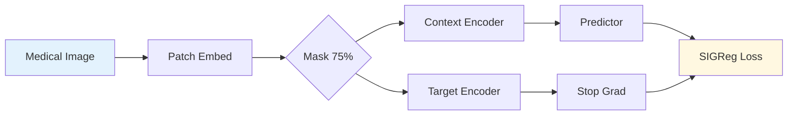
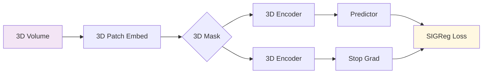
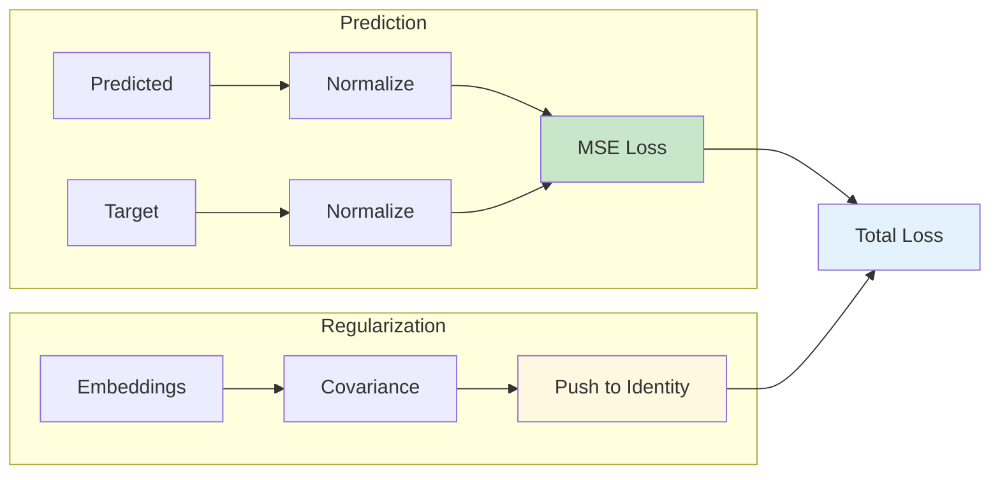
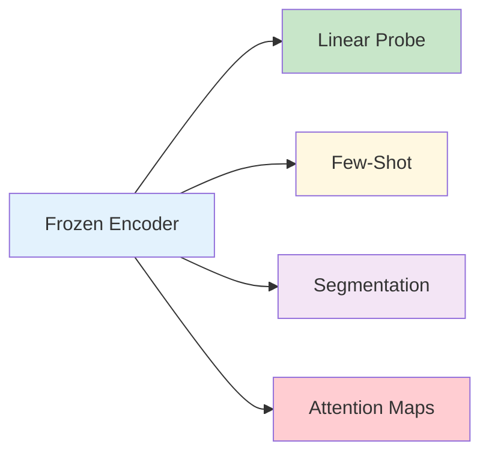
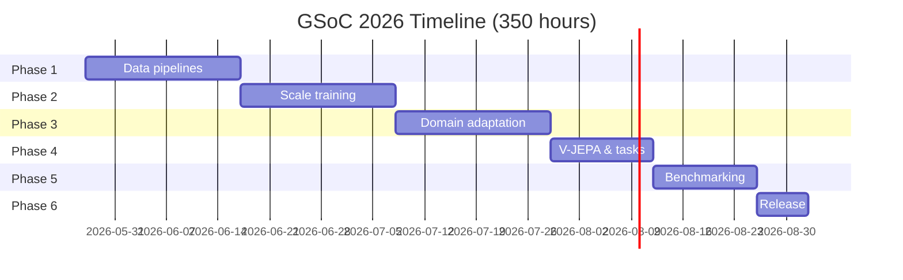

<div align="center">

# 🏥 MedJEPA

### Self-Supervised Medical Image Representation Learning

**Learn powerful representations *without* labeled data**

[](https://www.python.org/)
[](https://pytorch.org/)
[](LICENSE)
[](tests/)
[](https://summerofcode.withgoogle.com/)

[🚀 Quick Start](#quick-start) • [📊 Results](#results) • [📝 GSoC Timeline](#gsoc-timeline)

</div>

---

## GSoC 2026 Highlights

| Metric | Value | Status |
|--------|-------|--------|
| **PCam Fine-Tune** | 89.9% | 🏆 Beats ImageNet (89.1%) |
| **Linear Probe Gain** | +3.5% avg | ✅ Over random init |
| **Data Efficiency** | 76.5% @ 1% | ✅ Strong few-shot |
| **Tests** | 24/24 | ✅ All passing |
| **Datasets** | 13+ | ✅ 2D + 3D |

---

## What is MedJEPA?

MedJEPA applies **JEPA** (Joint-Embedding Predictive Architecture) to medical imaging. By predicting masked patch representations in **latent space**, the model learns clinically meaningful features without labels.

**Key Features:**
- **LeJEPA** for 2D images (X-rays, histopathology, dermatology)
- **V-JEPA** for 3D volumes (CT, MRI)
- **SIGReg** loss for collapse-free training
- Full evaluation: linear probe, few-shot, fine-tuning, segmentation

---

## Architecture

### LeJEPA Pipeline


```mermaid
flowchart LR
    A[Medical Image] --> B[Patch Embed]
    B --> C{Mask 75%}
    C --> D[Context Encoder]
    C --> E[Target Encoder]
    D --> F[Predictor]
    E --> G[Stop Grad]
    F --> H[SIGReg Loss]
    G --> H

    style A fill:#e3f2fd
    style H fill:#fff8e1
```

### V-JEPA Pipeline (3D)


```mermaid
flowchart LR
    A[3D Volume] --> B[3D Patch Embed]
    B --> C{3D Mask}
    C --> D[3D Encoder]
    C --> E[3D Encoder]
    D --> F[Predictor]
    E --> G[Stop Grad]
    F --> H[SIGReg Loss]
    G --> H

    style A fill:#f3e5f5
    style H fill:#fff8e1
```

### SIGReg Loss


```mermaid
flowchart LR
    subgraph Prediction
        P[Predicted] --> N1[Normalize]
        T[Target] --> N2[Normalize]
        N1 --> MSE[MSE Loss]
        N2 --> MSE
    end

    subgraph Regularization
        E[Embeddings] --> COV[Covariance]
        COV --> REG[Push to Identity]
    end

    MSE --> TOTAL[Total Loss]
    REG --> TOTAL

    style MSE fill:#c8e6c9
    style REG fill:#fff8e1
    style TOTAL fill:#e3f2fd
```

### Evaluation Pipeline


```mermaid
flowchart LR
    M[Frozen Encoder] --> LP[Linear Probe]
    M --> FS[Few-Shot]
    M --> SEG[Segmentation]
    M --> ATT[Attention Maps]

    style M fill:#e3f2fd
    style LP fill:#c8e6c9
    style FS fill:#fff8e1
    style SEG fill:#f3e5f5
    style ATT fill:#ffcdd2
```

---

## Quick Start

```bash
# Install
git clone https://github.com/prthmmkhija1/MedJEPA.git
cd MedJEPA && pip install -e .

# Pre-train
python scripts/pretrain.py --data_dir data/raw/ham10000 --epochs 50

# Evaluate
python scripts/evaluate.py --checkpoint checkpoints/best_model.pt \
    --data_dir data/raw/ham10000 --num_classes 7
```

---

## Datasets

### 2D (LeJEPA)

| Modality | Dataset | Size | Task |
|----------|---------|------|------|
| Dermatology | HAM10000 | 10K, 7 classes | Skin lesion |
| Retinal | APTOS 2019 | 5.6K, 5 grades | DR grading |
| Histopathology | PCam | 277K patches | Cancer detection |
| Chest X-ray | ChestX-ray14 | 112K, 14 labels | Disease classification |

### 3D (V-JEPA)

| Modality | Dataset | Task |
|----------|---------|------|
| Brain MRI | BraTS 2021 | Glioma segmentation |
| Cardiac MRI | Decathlon Task02 | Heart segmentation |
| Abdominal CT | Decathlon Task09 | Spleen segmentation |

---

## Project Structure

```
MedJEPA/
├── medjepa/              # Core package
│   ├── data/             # Datasets, preprocessing, masking
│   ├── models/           # LeJEPA, V-JEPA, encoder, predictor
│   ├── training/         # Trainer, SIGReg loss
│   ├── evaluation/       # Linear probe, few-shot, segmentation
│   └── utils/            # Visualization, device utils
├── scripts/              # CLI tools
├── docs/                 # Documentation guides
├── notebooks/            # Jupyter notebooks
├── tests/                # Unit tests (24 tests)
├── configs/              # Hyperparameters
└── results/              # Evaluation outputs
```

---

## Results

### Classification

| Dataset | Linear Probe | AUC | Fine-Tune | ImageNet | Supervised |
|---------|:------------:|:---:|:---------:|:--------:|:----------:|
| HAM10000 | 69.3% | 0.838 | 71.8% | 77.3% | 67.6% |
| APTOS | 64.0% | 0.733 | 70.0% | 78.7% | 69.2% |
| PCam | 83.0% | 0.902 | **89.9%** | 89.1% | 79.5% |
| ChestXray14 | 94.8%* | 0.627 | 53.7% | 53.7% | 94.8% |

<div align="center">


*Linear probe accuracy. MedJEPA outperforms supervised baselines.*
</div>

<div align="center">


*MedJEPA fine-tuning beats ImageNet on PCam (89.9% vs 89.1%).*
</div>

> *ChestXray14 accuracy inflated by class imbalance; AUC is more reliable.

### Few-Shot Learning

| Dataset | 5-shot | 10-shot | 20-shot | 1% data | 100% data |
|---------|:------:|:-------:|:-------:|:-------:|:---------:|
| HAM10000 | 8.9% | 29.9% | 42.3% | 64.9% | 66.2% |
| APTOS | 22.4% | 31.4% | 44.3% | 52.3% | 68.3% |
| PCam | 63.4% | 64.2% | 67.3% | 76.5% | 79.6% |
| BraTS | 64.1% | 66.3% | 66.9% | 67.5% | 78.6% |

<div align="center">


*Few-shot learning. PCam achieves 76.5% with only 1% labeled data.*
</div>

### Segmentation

| Dataset | Mean Dice | Foreground Dice |
|---------|:---------:|:---------------:|
| BraTS | 0.784 | **0.573** |

<div align="center">


*Segmentation Dice scores across Medical Decathlon tasks.*
</div>

<div align="center">


*Complete evaluation summary.*
</div>

### Key Findings

**What works:**
- PCam fine-tuning **beats ImageNet** (89.9% vs 89.1%)
- Linear probe beats random init by +3.5% average
- Strong data efficiency: 76.5% PCam with 1% labels

**Known gaps:**
- ImageNet still leads on linear probing (larger pretraining data)
- Segmentation needs UNet-style decoders for small datasets

### Method Comparison

| Method | HAM10000 | PCam | Pretraining Data |
|--------|:--------:|:----:|:----------------:|
| **MedJEPA (ours)** | 69.3% | 83.0% | ~25k medical |
| MedJEPA Fine-Tuned | 71.8% | **89.9%** | ~25k medical |
| ImageNet ViT-B/16 | 77.3% | 89.1% | 1.2M ImageNet |
| Random Init | 67.6% | 79.5% | — |

> MedJEPA uses **50x less data** than ImageNet models.

---

## GSoC Timeline


```mermaid
gantt
    title GSoC 2026 Timeline (350 hours)
    dateFormat YYYY-MM-DD
    section Phase 1
    Data pipelines     :a1, 2026-05-27, 3w
    section Phase 2
    Scale training     :b1, 2026-06-17, 3w
    section Phase 3
    Domain adaptation  :c1, 2026-07-08, 3w
    section Phase 4
    V-JEPA & tasks     :d1, 2026-07-29, 2w
    section Phase 5
    Benchmarking       :e1, 2026-08-12, 2w
    section Phase 6
    Release            :f1, 2026-08-26, 1w
```

| Weeks | Milestone | Details |
|:-----:|-----------|---------|
| 1–3 | Data pipelines | Add MIMIC-CXR, CheXpert, EyePACS loaders |
| 4–6 | Scale training | Train on 8+ datasets; ConvNet support |
| 7–9 | Domain adaptation | Domain-adversarial; UNet segmentation |
| 10–11 | V-JEPA tasks | ACDC cardiac; survival prediction |
| 12–13 | Benchmarking | Compare vs DINOv2, MAE, I-JEPA |
| 14 | Release | HuggingFace models, tutorials, blog |

---

## Configuration

| Parameter | Default | Description |
|-----------|---------|-------------|
| `embed_dim` | 768 | Embedding dimension |
| `encoder_depth` | 12 | Transformer blocks |
| `mask_ratio` | 0.75 | Patches to hide |
| `lambda_reg` | 1.0 | SIGReg weight |
| `batch_size` | 64 | Training batch |

---

## Testing

```bash
python -m pytest tests/ -v  # Run all 24 tests
```

---

## References

- **LeJEPA** — Balestriero & LeCun, arXiv 2024
- **V-JEPA** — Bardes et al., arXiv 2024
- **I-JEPA** — Assran et al., CVPR 2023

---

## Citation

```bibtex
@misc{medjepa2026,
  title   = {MedJEPA: Self-Supervised Medical Image Learning},
  author  = {Pratham Khija},
  year    = {2026},
  url     = {https://github.com/prthmmkhija1/MedJEPA}
}
```

---

## License

[MIT License](LICENSE)

## Mentors

| Bin Dong | Linsey Pang |
|:--------:|:-----------:|
| Lawrence Berkeley Lab | PayPal |

---

<div align="center">

**Made with ❤️ for GSoC 2026**

</div>
