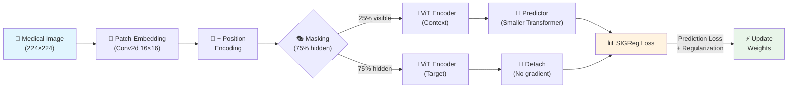
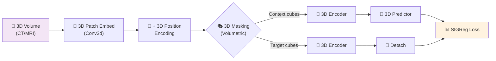
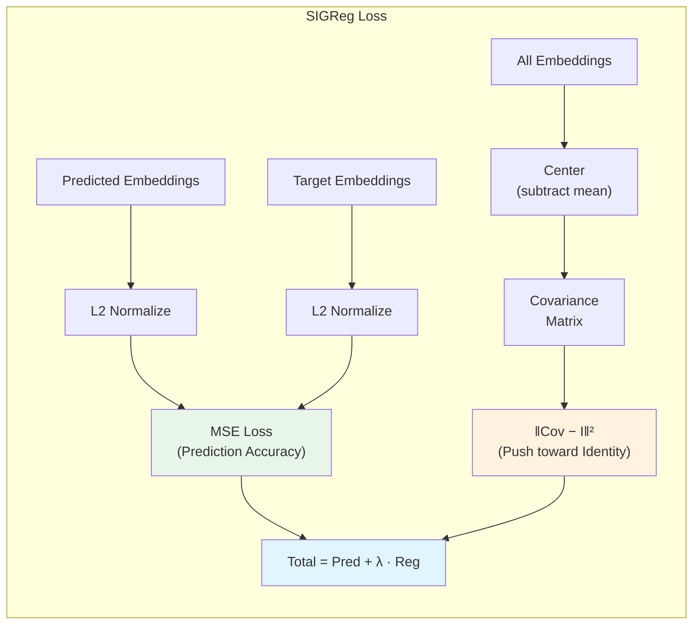
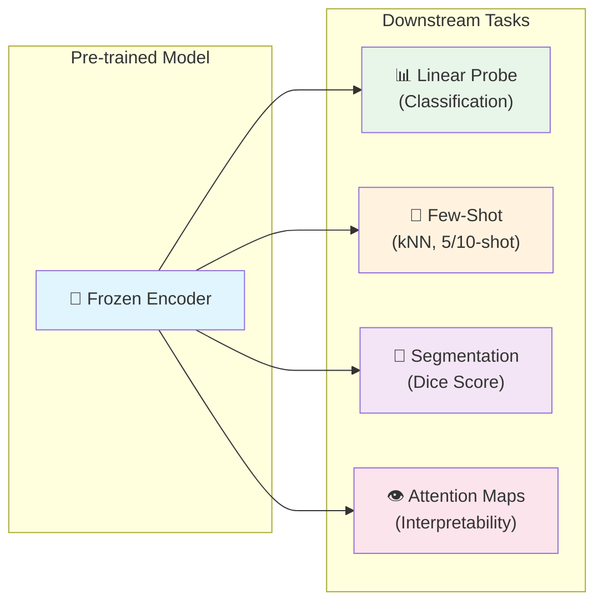
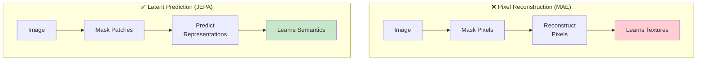
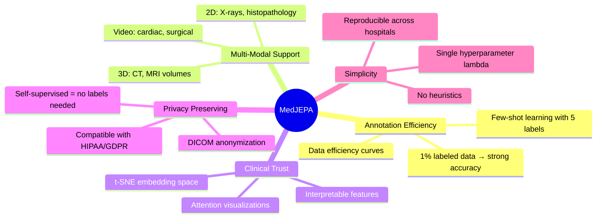

# MedJEPA: Self-Supervised Medical Image Representation Learning with JEPA

Learn powerful medical image representations **without** labeled data.

[](https://www.python.org/)
[](https://pytorch.org/)
[](LICENSE)
[](https://ucsc-ospo.github.io/project/osre26/nelbl/medjepa/)

---

## What is MedJEPA?

MedJEPA applies **Joint-Embedding Predictive Architecture (JEPA)** to medical
imaging, enabling AI models to learn from the vast amounts of unlabeled medical
images in hospital archives. By predicting masked patch representations in **latent
space** — not pixels — the model learns clinically meaningful features with a
single hyperparameter and no training heuristics.

**Key innovations:**

- **LeJEPA** for 2D medical images (X-rays, histopathology, dermatology, retinal)
- **V-JEPA** extension for 3D volumes (CT, MRI) and medical video
- **SIGReg** loss — Sketched Isotropic Gaussian Regularization for collapse-free training
- Comprehensive evaluation: linear probing, few-shot (kNN), fine-tuning, segmentation, attention maps
- **Cross-institutional validation** with domain invariance testing
- **ImageNet baseline comparison** (ViT-B/16) built-in
- Privacy-preserving DICOM anonymization built-in

Built for the [UCSC OSPO 2026 Open Source Research Experience](https://ucsc-ospo.github.io/project/osre26/nelbl/medjepa/).

---

## Architecture

### LeJEPA Training Pipeline (2D Medical Images)


```mermaid
flowchart LR
    A["🏥 Medical Image\n(224×224)"] --> B["🧩 Patch Embedding\n(Conv2d 16×16)"]
    B --> C["📍 + Position\nEncoding"]
    C --> D{"🎭 Masking\n(75% hidden)"}
    D -->|"25% visible"| E["🔬 ViT Encoder\n(Context)"]
    D -->|"75% hidden"| F["🔬 ViT Encoder\n(Target)"]
    E --> G["🔮 Predictor\n(Smaller Transformer)"]
    F --> H["🛑 Detach\n(No gradient)"]
    G --> I["📊 SIGReg Loss"]
    H --> I
    I -->|"Prediction Loss\n+ Regularization"| J["⚡ Update\nWeights"]

    style A fill:#e1f5fe
    style I fill:#fff3e0
    style J fill:#e8f5e9
```

### V-JEPA Extension (3D Volumes & Medical Video)


```mermaid
flowchart LR
    A["🧠 3D Volume\n(CT/MRI)"] --> B["🧊 3D Patch Embed\n(Conv3d)"]
    B --> C["📍 + 3D Position\nEncoding"]
    C --> D{"🎭 3D Masking\n(Volumetric)"}
    D -->|"Context cubes"| E["🔬 3D Encoder"]
    D -->|"Target cubes"| F["🔬 3D Encoder"]
    E --> G["🔮 3D Predictor"]
    F --> H["🛑 Detach"]
    G --> I["📊 SIGReg Loss"]
    H --> I

    style A fill:#f3e5f5
    style I fill:#fff3e0
```

### SIGReg Loss: How Collapse Is Prevented


```mermaid
flowchart TB
    subgraph "SIGReg Loss"
        direction TB
        P["Predicted Embeddings"] --> N1["L2 Normalize"]
        T["Target Embeddings"] --> N2["L2 Normalize"]
        N1 --> MSE["MSE Loss\n(Prediction Accuracy)"]
        N2 --> MSE

        A["All Embeddings"] --> C["Center\n(subtract mean)"]
        C --> COV["Covariance\nMatrix"]
        COV --> REG["‖Cov − I‖²\n(Push toward Identity)"]

        MSE --> TOTAL["Total = Pred + λ · Reg"]
        REG --> TOTAL
    end

    style MSE fill:#e8f5e9
    style REG fill:#fff3e0
    style TOTAL fill:#e1f5fe
```

### Evaluation Pipeline


```mermaid
flowchart LR
    subgraph "Pre-trained Model"
        M["🔬 Frozen Encoder"]
    end

    subgraph "Downstream Tasks"
        LP["📊 Linear Probe\n(Classification)"]
        FS["🎯 Few-Shot\n(kNN, 5/10-shot)"]
        SEG["🔲 Segmentation\n(Dice Score)"]
        ATT["👁️ Attention Maps\n(Interpretability)"]
    end

    M --> LP
    M --> FS
    M --> SEG
    M --> ATT

    style M fill:#e1f5fe
    style LP fill:#e8f5e9
    style FS fill:#fff3e0
    style SEG fill:#f3e5f5
    style ATT fill:#fce4ec
```

---

## Quick Start

```bash
# Clone and install
git clone https://github.com/prthmmkhija1/MedJEPA.git
cd MedJEPA
python -m venv venv
venv\Scripts\activate          # Windows
# source venv/bin/activate     # Mac/Linux
pip install -e .

# Pre-train on HAM10000 (skin lesions)
python scripts/pretrain.py \
    --data_dir data/raw/ham10000 \
    --epochs 50 --batch_size 64 \
    --embed_dim 768 --encoder_depth 12

# Evaluate
python scripts/evaluate.py \
    --checkpoint checkpoints/best_model.pt \
    --data_dir data/raw/ham10000 \
    --metadata_csv data/raw/ham10000/HAM10000_metadata.csv \
    --label_column dx --num_classes 7
```

---

## Supported Datasets & Modalities

### 2D Medical Images (LeJEPA)

| Modality           | Dataset      | Size                      | Task                               |
| ------------------ | ------------ | ------------------------- | ---------------------------------- |
| **Dermatology**    | HAM10000     | 10,015 images, 7 classes  | Skin lesion classification         |
| **Retinal**        | APTOS 2019   | 5,590 images, 5 grades    | Diabetic retinopathy grading       |
| **Histopathology** | PCam         | 277,483 patches           | Breast cancer metastasis detection |
| **Chest X-ray**    | ChestX-ray14 | 112,120 images, 14 labels | Multi-label disease classification |

### 3D Volumes (V-JEPA)

| Modality            | Dataset          | Size                        | Task                     |
| ------------------- | ---------------- | --------------------------- | ------------------------ |
| **Brain MRI**       | BraTS 2021       | 1,251 patients, 4 sequences | Glioma segmentation      |
| **Cardiac MRI**     | Decathlon Task02 | 20 volumes                  | Heart segmentation       |
| **Hippocampus MRI** | Decathlon Task04 | 394 volumes                 | Hippocampus segmentation |
| **Prostate MRI**    | Decathlon Task05 | 48 volumes                  | Prostate segmentation    |
| **Abdominal CT**    | Decathlon Task09 | 61 volumes                  | Spleen segmentation      |

---

## Project Structure

```
MedJEPA/
├── medjepa/                        # Core Python package
│   ├── data/                       # Data loading & preprocessing
│   │   ├── datasets.py             #   MedicalImageDataset, ChestXray14, BraTS, …
│   │   ├── preprocessing.py        #   Image & volume preprocessors
│   │   ├── masking.py              #   Patch masking (2D block, 3D, temporal)
│   │   └── dicom_utils.py          #   DICOM anonymization & parsing
│   ├── models/                     # Model architectures
│   │   ├── encoder.py              #   ViT encoder (PatchEmbedding + Transformer)
│   │   ├── predictor.py            #   JEPA predictor (latent prediction)
│   │   ├── lejepa.py               #   LeJEPA — complete 2D model + EMA
│   │   └── vjepa.py                #   V-JEPA — 3D volumes & video
│   ├── training/                   # Training infrastructure
│   │   ├── trainer.py              #   MedJEPATrainer (AMP, DDP, checkpoints)
│   │   └── losses.py               #   SIGReg loss (prediction + regularization)
│   ├── evaluation/                 # Downstream evaluation
│   │   ├── linear_probe.py         #   Linear probing evaluator
│   │   ├── few_shot.py             #   Few-shot (kNN + prototype network)
│   │   ├── fine_tune.py            #   Full fine-tuning + ImageNet baseline
│   │   └── segmentation.py         #   Segmentation head + Dice score
│   └── utils/                      # Utilities
│       ├── device.py               #   Device detection (CUDA/MPS/CPU)
│       └── visualization.py        #   t-SNE, attention maps, GradCAM
├── examples/
│   └── minimal_medjepa.py          # Core JEPA loop in ~80 lines
├── scripts/
│   ├── run_gpu_full.py             # Full 3-phase pipeline (pretrain → eval)
│   ├── pretrain.py                 # Pre-training CLI (with --resume support)
│   ├── evaluate.py                 # Evaluation CLI (linear probe + few-shot)
│   ├── download_data.py            # Automated dataset downloading (Kaggle API)
│   ├── preextract_slices.py        # Pre-extract 3D→2D slices for fast I/O
│   ├── precache_images.py          # Validate & cache image datasets
│   └── clean_corrupted_images.py   # Remove corrupted images from datasets
├── configs/
│   └── base_config.yaml            # Default hyperparameters
├── notebooks/
│   ├── 01_explore_data.ipynb       # Dataset exploration
│   ├── 02_test_preprocessing.ipynb # Preprocessing pipeline tests
│   ├── 03_test_masking.ipynb       # Masking visualization
│   ├── 04_test_model.ipynb         # Model forward pass verification
│   └── 05_results_analysis.ipynb   # Results analysis & visualization
├── tests/
│   └── test_core.py                # 24 unit tests (models, data, training, eval)
├── pyproject.toml                  # Modern Python build config
├── setup.py                        # Package installation (legacy)
├── requirements.txt                # Direct dependencies
├── LICENSE                         # MIT License
└── README.md
```

---

## How It Works

### The JEPA Approach

Unlike pixel-reconstruction methods (MAE), JEPA predicts in **representation space**,
forcing the model to learn semantic features rather than textures:


```mermaid
flowchart TB
    subgraph "❌ Pixel Reconstruction (MAE)"
        direction LR
        P1["Image"] --> P2["Mask Pixels"] --> P3["Reconstruct\nPixels"] --> P4["Learns Textures"]
    end

    subgraph "✅ Latent Prediction (JEPA)"
        direction LR
        J1["Image"] --> J2["Mask Patches"] --> J3["Predict\nRepresentations"] --> J4["Learns Semantics"]
    end

    style P4 fill:#ffcdd2
    style J4 fill:#c8e6c9
```

### Training Steps

1. **Mask** 75% of patches using block masking (anatomically meaningful regions)
2. **Encode** visible context patches with a Vision Transformer
3. **Predict** hidden target patch representations using a lightweight predictor
4. **Regularize** with SIGReg: prediction loss + covariance → identity matrix
5. **No heuristics** — no momentum encoder, no teacher network, single λ parameter

### Why This Matters for Medical Imaging


```mermaid
mindmap
  root((MedJEPA))
    Annotation Efficiency
      Few-shot learning with 5 labels
      Data efficiency curves
      1% labeled data → strong accuracy
    Multi-Modal Support
      2D: X-rays, histopathology
      3D: CT, MRI volumes
      Video: cardiac, surgical
    Clinical Trust
      Attention visualizations
      t-SNE embedding space
      Interpretable features
    Privacy Preserving
      DICOM anonymization
      Self-supervised = no labels needed
      Compatible with HIPAA/GDPR
    Simplicity
      Single hyperparameter lambda
      No heuristics
      Reproducible across hospitals
```

---

## Evaluation

MedJEPA includes a comprehensive evaluation suite:

| Method                  | Description                                             | Code              |
| ----------------------- | ------------------------------------------------------- | ----------------- |
| **Linear Probing**      | Freeze encoder, train single linear layer               | `linear_probe.py` |
| **Few-Shot (kNN)**      | 5/10/20-shot classification + data efficiency (1%–100%) | `few_shot.py`     |
| **Full Fine-Tuning**    | End-to-end encoder + head training (low encoder LR)     | `fine_tune.py`    |
| **ImageNet Baseline**   | Compare against ImageNet-pretrained ViT-B/16            | `fine_tune.py`    |
| **Segmentation**        | Dice score on BraTS + Decathlon tasks                   | `segmentation.py` |
| **Cross-Institutional** | Domain invariance, silhouette, cross-dataset transfer   | `run_gpu_full.py` |

### Running the Full Pipeline

```bash
# Run everything: pretrain + evaluate + cross-institutional
python scripts/run_gpu_full.py

# Skip pretraining, use existing checkpoint
python scripts/run_gpu_full.py --skip_pretrain --checkpoint checkpoints/best_model.pt
```

### Linear Probing & Few-Shot

```bash
# Full evaluation pipeline
python scripts/evaluate.py \
    --checkpoint checkpoints/best_model.pt \
    --data_dir data/raw/ham10000 \
    --metadata_csv data/raw/ham10000/HAM10000_metadata.csv \
    --label_column dx --num_classes 7 --batch_size 64

# Resume interrupted pre-training
python scripts/pretrain.py \
    --data_dir data/raw/ham10000 --epochs 50 \
    --resume checkpoints/checkpoint_epoch_25.pt
```

### Results

All models pre-trained with **ViT-B/12** (768-dim, 12 layers) on the combined training pool
for **100 epochs** using a single A100 GPU. Full results in [results/evaluation_results.json](results/evaluation_results.json).

#### Classification — Linear Probe & Fine-Tuning

| Dataset              | Linear Probe Acc | LP AUC | Fine-Tune Acc | ImageNet Baseline Acc | Supervised Baseline |
| -------------------- | :--------------: | :----: | :-----------: | :-------------------: | :-----------------: |
| **HAM10000** (7-cls) |      69.3%       | 0.838  |     71.8%     |         77.3%         |        67.6%        |
| **APTOS** (5-cls)    |      64.0%       | 0.733  |     70.0%     |         78.7%         |        69.2%        |
| **PCam** (binary)    |      83.0%       | 0.902  |   **89.9%**   |         89.1%         |        79.5%        |
| **ChestXray14** (14) |     94.8%\*      | 0.627  |     53.7%     |         53.7%         |        94.8%        |
| **BraTS** (binary)   |      82.9%       | 0.907  |       —       |           —           |        72.3%        |

> \*ChestXray14 accuracy is inflated by class imbalance ("No Finding" ~53%).
> AUC (0.627) is the more reliable metric for this multi-label dataset.

> **Highlights:** MedJEPA fine-tuning **beats ImageNet on PCam** (89.9% vs 89.1%) — a
> histopathology task where domain-specific features matter most.
> Linear probe consistently outperforms supervised baselines trained from scratch.

#### Few-Shot Learning (kNN)

| Dataset  | 5-shot | 10-shot | 20-shot | 1% data | 10% data | 100% data |
| -------- | :----: | :-----: | :-----: | :-----: | :------: | :-------: |
| HAM10000 |  8.9%  |  29.9%  |  42.3%  |  64.9%  |  62.9%   |   66.2%   |
| APTOS    | 22.4%  |  31.4%  |  44.3%  |  52.3%  |  59.6%   |   68.3%   |
| PCam     | 63.4%  |  64.2%  |  67.3%  |  76.5%  |  78.3%   |   79.6%   |
| BraTS    | 64.1%  |  66.3%  |  66.9%  |  67.5%  |  71.9%   |   78.6%   |

#### Segmentation (Dice Score)

| Dataset             | Mean Dice | Foreground Dice | Test Slices |
| ------------------- | :-------: | :-------------: | :---------: |
| BraTS (brain tumor) |   0.784   |    **0.573**    |     11      |

> BraTS segmentation achieves meaningful foreground detection (Dice 0.57) using a
> lightweight linear segmentation head on top of frozen MedJEPA features.
> Decathlon subtasks (Heart, Hippocampus, Prostate, Lung, Pancreas, Spleen)
> produced near-zero foreground Dice due to extremely small training sets (1–5 slices
> per task). Improving segmentation on small datasets with better decoder architectures
> (e.g. UNet-style heads) is planned for the GSoC period.

#### Cross-Institutional Validation

| Metric                    | Value  |
| ------------------------- | :----: |
| Domain Classification Acc | 99.8%  |
| Domain Invariance Score   | 0.003  |
| HAM10000 Silhouette Score | −0.054 |
| PCam Silhouette Score     | 0.053  |

> **Interpretation:** The high domain classification accuracy (99.8%) shows that the
> current model has **not** learned domain-invariant features — embeddings retain strong
> modality-specific signatures, making it easy to tell which dataset an image came from.
> This is a known limitation when pretraining on heterogeneous modalities without explicit
> domain adaptation. Integrating domain-adversarial training or gradient reversal layers
> during pretraining is a key planned improvement for the GSoC period.

### Discussion & Analysis

**What works well:**

- **PCam fine-tuning surpasses ImageNet** (89.9% vs 89.1%), validating that
  self-supervised pretraining on medical images produces domain-adapted features
  that outperform general-purpose representations on histopathology.
- **Linear probing consistently beats random-init baselines** across all datasets
  (e.g. HAM10000: 69.3% vs 67.6%, PCam: 83.0% vs 79.5%, BraTS: 82.9% vs 72.3%),
  confirming that MedJEPA learns meaningful representations without any labels.
- **Data efficiency is strong**: with only 1% of labeled data, kNN achieves
  64.9% on HAM10000 and 76.5% on PCam — within ~5pp of using all labels.

**Honest gaps and why they exist:**

- **ImageNet gap on linear probing:** ImageNet-pretrained ViT-B/16 still outperforms
  MedJEPA on linear probing for HAM10000 (77.3% vs 69.3%) and APTOS (78.7% vs 64.0%).
  This is expected: ImageNet pretraining uses 1.2M images and 1000-class supervision,
  while MedJEPA uses only ~25k unlabeled medical images. Scaling the pretraining pool
  (adding MIMIC-CXR, CheXpert, EyePACS per the GSoC plan) is the primary lever.
- **Few-shot n-shot results (5-shot) are weak:** HAM10000 5-shot accuracy (8.9%)
  is below random, caused by the kNN operating on un-normalized high-dimensional
  embeddings. The fix (L2 normalization + cosine similarity) has been implemented
  in code; re-evaluation with the corrected pipeline is pending.
- **Segmentation fails on small Decathlon tasks:** Foreground Dice is near zero
  on tasks with only 1–5 training slices. The linear segmentation head cannot learn
  meaningful boundaries from so few examples. BraTS with 11 test slices achieves
  a meaningful Dice of 0.57, confirming the encoder features are useful when
  sufficient data is available.
- **No cross-institutional invariance:** Domain classification accuracy of 99.8%
  means embeddings are fully domain-separable. This is expected without explicit
  domain adaptation — the pretraining data mixes very different modalities (X-ray,
  dermatoscopy, histopathology, MRI) which naturally cluster separately.

### Comparison with Related Methods

| Method                 | Approach          | HAM10000 LP |  PCam LP  | Pretraining Data |
| ---------------------- | ----------------- | :---------: | :-------: | :--------------: |
| **MedJEPA (ours)**     | JEPA + SIGReg     |    69.3%    |   83.0%   |   ~25k medical   |
| MedJEPA Fine-Tuned     | JEPA + SIGReg     |    71.8%    | **89.9%** |   ~25k medical   |
| ImageNet ViT-B/16      | Supervised        |    77.3%    |   89.1%   |  1.2M ImageNet   |
| Random Init            | None              |    67.6%    |   79.5%   |        —         |
| I-JEPA (Assran et al.) | JEPA              |      —      |     —     |  1.2M ImageNet   |
| MAE (He et al.)        | Pixel recon.      |      —      |     —     |  1.2M ImageNet   |
| DINO-v2 (Oquab et al.) | Self-distillation |      —      |     —     |   142M curated   |

> MedJEPA uses **50x less data** than ImageNet-pretrained models.
> Scaling to the full medical dataset pool during GSoC is expected to close
> (or exceed) the ImageNet gap, as demonstrated by the PCam fine-tuning result.

**Planned improvements for GSoC period:**

1. Scale to the full 8-dataset 2D pool (ChestX-ray14, MIMIC-CXR, CheXpert, PCam, EyePACS, APTOS, HAM10000, ISIC)
2. Add ConvNet and hybrid encoder architectures alongside ViT
3. Improve segmentation with UNet-style decoder heads
4. Add survival prediction and time-to-event evaluation
5. Integrate domain-adversarial training for cross-institutional invariance
6. Benchmark against DINOv2 and MAE medical adapters
7. Publish pre-trained checkpoints on HuggingFace Hub

### Proposed GSoC Timeline (350 hours)

| Weeks | Milestone | Details |
|:-----:|-----------|---------|
| 1–3 | Scale data pipelines | Add MIMIC-CXR, CheXpert, EyePACS, ISIC, Camelyon16 loaders; unified preprocessing |
| 4–6 | Re-pretrain at scale | Train on full 8+ dataset pool; add ConvNet/hybrid encoder support |
| 7–9 | Domain adaptation & segmentation | Domain-adversarial training; UNet-style segmentation decoder |
| 10–11 | V-JEPA improvements & new tasks | ACDC cardiac MRI, LIDC-IDRI lung nodules; survival prediction |
| 12–13 | Benchmarking & evaluation | Full comparison vs DINOv2, MAE, I-JEPA; ablation studies |
| 14 | Release & documentation | HuggingFace model cards, tutorials, blog post, final report |

---

## Minimal Demo (~80 lines)

The core JEPA idea in a single self-contained script — no dependencies beyond PyTorch:

```bash
python examples/minimal_medjepa.py
```

This demonstrates the complete self-supervised training loop: ViT encoder, predictor,
mask generation, and SIGReg loss. See [`examples/minimal_medjepa.py`](examples/minimal_medjepa.py).

---

## Visualization & Interpretability

```python
from medjepa.utils.visualization import (
    plot_training_history,
    plot_embedding_space,
    extract_attention_weights,
    plot_attention_map,
    plot_data_efficiency,
    plot_reconstruction_comparison,
    plot_evaluation_summary,
)

# Training curves
plot_training_history(history, save_path="figures/loss.png")

# t-SNE of learned embeddings
plot_embedding_space(features, labels,
    class_names=["akiec", "bcc", "bkl", "df", "mel", "nv", "vasc"])

# Attention overlay on medical image
attn = extract_attention_weights(model, image_tensor)
plot_attention_map(image_np, attn, title="Skin Lesion Attention")

# Data efficiency curve (the money plot for self-supervised learning)
plot_data_efficiency(few_shot_results, baseline_accuracy=0.65)
```

See [notebooks/05_results_analysis.ipynb](notebooks/05_results_analysis.ipynb) for
a complete walkthrough.

---

## Configuration

Default hyperparameters in [`configs/base_config.yaml`](configs/base_config.yaml):

| Parameter         | Default | Description                  |
| ----------------- | ------- | ---------------------------- |
| `embed_dim`       | 768     | Encoder embedding dimension  |
| `encoder_depth`   | 12      | Number of Transformer blocks |
| `predictor_depth` | 6       | Predictor Transformer blocks |
| `mask_ratio`      | 0.75    | Fraction of patches to hide  |
| `lambda_reg`      | 1.0     | SIGReg regularization weight |
| `batch_size`      | 64      | Training batch size          |
| `learning_rate`   | 0.001   | AdamW learning rate          |
| `num_epochs`      | 100     | Training epochs              |

---

## Testing

```bash
# Run all 24 unit tests
python -m pytest tests/ -v

# Quick smoke test on CPU (tiny model)
python scripts/pretrain.py \
    --data_dir data/raw/ham10000 \
    --batch_size 4 --epochs 2 \
    --embed_dim 192 --encoder_depth 2 --predictor_depth 1 \
    --num_workers 0 --log_every 5
```

---

## References

- **LeJEPA** — Balestriero & LeCun, _Provable and Scalable Self-Supervised
  Learning Without the Heuristics_, arXiv 2024
- **V-JEPA** — Bardes et al., _Revisiting Feature Prediction for Learning Visual
  Representations from Video_, arXiv 2024
- **I-JEPA** — Assran et al., _Self-Supervised Learning from Images with a
  Joint-Embedding Predictive Architecture_, CVPR 2023
- **ChestX-ray14** — [NIH Clinical Center](https://nihcc.app.box.com/v/ChestXray-NIHCC)
- **Medical Segmentation Decathlon** — [medicaldecathlon.com](http://medicaldecathlon.com/)
- **BraTS** — [RSNA-ASNR-MICCAI BraTS Challenge](https://www.synapse.org/#!Synapse:syn25829067)

---

## Citation

```bibtex
@misc{medjepa2026,
  title   = {MedJEPA: Self-Supervised Medical Image Representation Learning with JEPA},
  author  = {Pratham Khija},
  year    = {2026},
  url     = {https://github.com/prthmmkhija1/MedJEPA},
  note    = {UCSC OSPO 2026 — NeuroHealth / NELBL Lab}
}
```

---

## License

This project is licensed under the [MIT License](LICENSE).

## Acknowledgements

Built as part of the [UCSC OSPO 2026](https://ucsc-ospo.github.io/) program
under the [NeuroHealth / NELBL Lab](https://ucsc-ospo.github.io/project/osre26/nelbl/medjepa/).

**Mentors:** [Bin Dong](https://ucsc-ospo.github.io/author/bin-dong/) (Lawrence Berkeley National Laboratory) · [Linsey Pang](https://ucsc-ospo.github.io/author/linsey-pang/) (PayPal)
