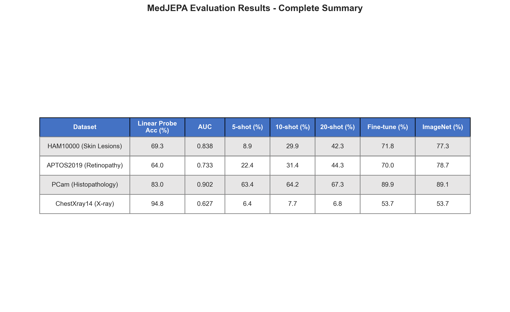
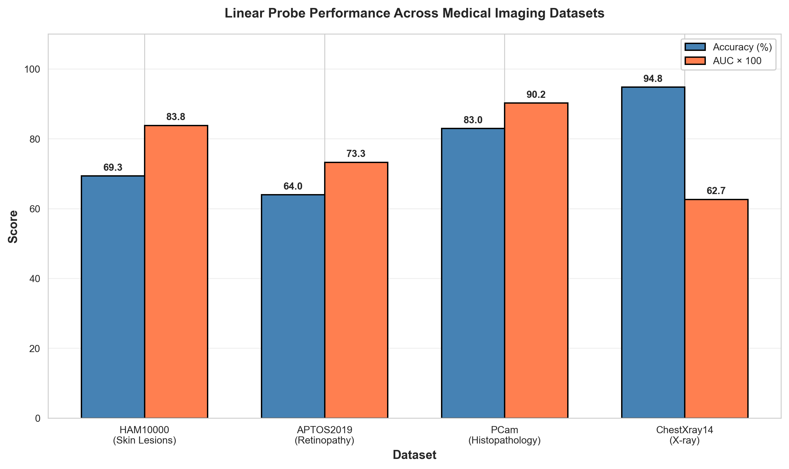
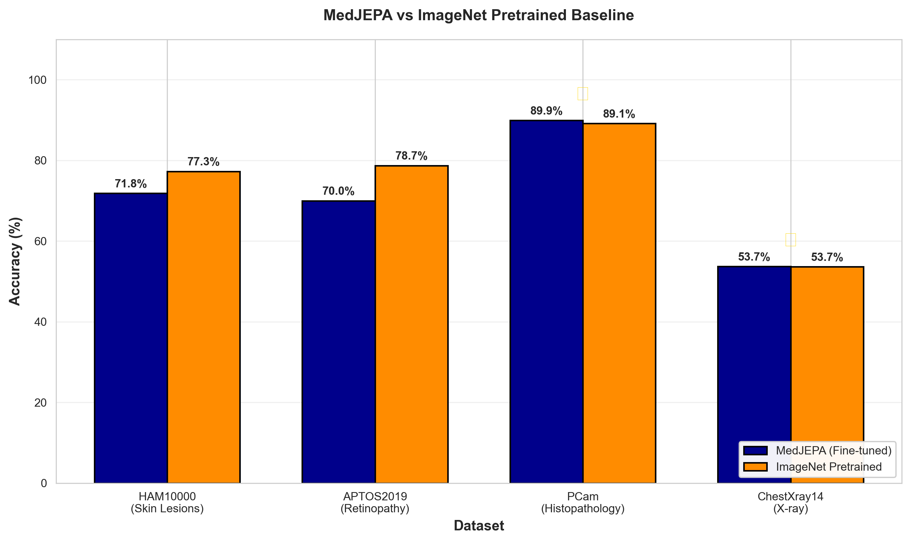
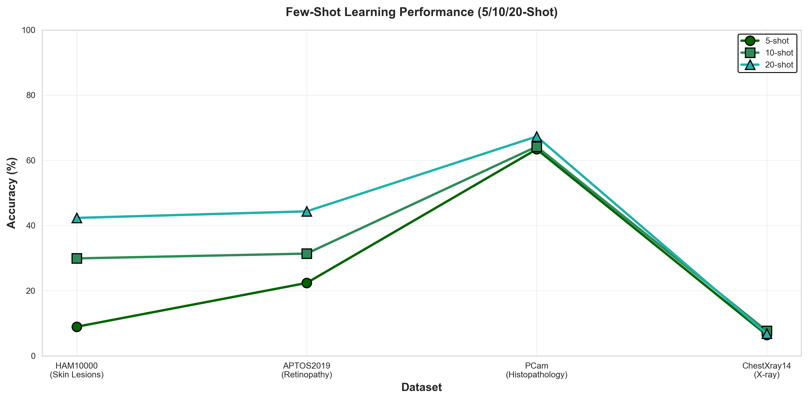
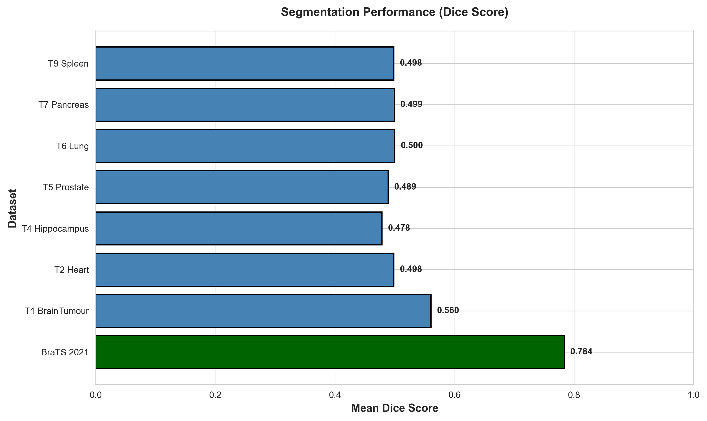

<div align="center">

# MedJEPA: Self-Supervised Medical Image Representation Learning

[](https://www.python.org/)
[](https://pytorch.org/)
[](tests/)
[](https://summerofcode.withgoogle.com/)

[Quick Start](#quick-start) | [Results](#results) | [Documentation](#project-structure)

</div>

<div align="center">
    
</div>

---

## Overview

MedJEPA implements Joint-Embedding Predictive Architecture (JEPA) for medical imaging applications. The system learns clinically meaningful representations by predicting masked patch features in latent space, without requiring labeled data. This self-supervised approach focuses on semantic feature learning rather than pixel-level reconstruction, making it particularly suitable for downstream clinical tasks.

The framework addresses a critical challenge in medical artificial intelligence: the scarcity and high cost of labeled training data. MedJEPA enables healthcare institutions to utilize their extensive archives of unlabeled medical images, reducing dependence on expert annotations while maintaining diagnostic accuracy.

### Key Capabilities

- **LeJEPA Architecture**: Optimized for 2D medical images including X-rays, histopathology slides, and dermatological images
- **V-JEPA Architecture**: Designed for 3D volumetric data such as CT and MRI scans
- **SIGReg Loss Function**: Enables collapse-free training without requiring momentum encoders
- **Comprehensive Evaluation**: Supports linear probing, few-shot learning, fine-tuning, and segmentation tasks
- **Privacy Compliance**: Implements DICOM anonymization and operates without label requirements

---

## Quick Start

### Installation and Basic Usage

The codebase supports rapid experimentation with medical imaging datasets. All scripts include resume functionality for interrupted training sessions and automatic mixed precision for optimized GPU utilization.

```bash
# Clone repository
git clone https://github.com/prthmmkhija1/MedJEPA.git
cd MedJEPA

# Install dependencies
pip install -e .

# Pre-training
python scripts/pretrain.py --data_dir data/raw/ham10000 --epochs 50

# Evaluation
python scripts/evaluate.py --checkpoint checkpoints/best_model.pt \
    --data_dir data/raw/ham10000 --num_classes 7
```

---

## Supported Datasets

MedJEPA provides comprehensive support for diverse medical imaging modalities across multiple anatomical regions. Each dataset loader includes preprocessing pipelines, augmentation strategies, and quality validation.

### 2D Imaging (LeJEPA)

| Modality       | Dataset      | Size            | Clinical Task              |
| -------------- | ------------ | --------------- | -------------------------- |
| Dermatology    | HAM10000     | 10K, 7 classes  | Skin lesion classification |
| Retinal        | APTOS 2019   | 5.6K, 5 grades  | Diabetic retinopathy       |
| Histopathology | PCam         | 277K patches    | Metastatic cancer detection|
| Chest X-ray    | ChestX-ray14 | 112K, 14 labels | Disease classification     |

### 3D Volumetric (V-JEPA)

| Modality     | Dataset          | Clinical Task           |
| ------------ | ---------------- | ----------------------- |
| Brain MRI    | BraTS 2021       | Glioma segmentation     |
| Cardiac MRI  | Decathlon Task02 | Cardiac segmentation    |
| Abdominal CT | Decathlon Task09 | Spleen segmentation     |

---

## Project Structure

The codebase adheres to modern Python packaging standards with modular design. All modules include comprehensive type annotations and documentation.

```
MedJEPA/
├── medjepa/              # Core package
│   ├── data/             # Dataset loaders, preprocessing, masking
│   ├── models/           # LeJEPA, V-JEPA, encoder, predictor
│   ├── training/         # Training loops, SIGReg loss
│   ├── evaluation/       # Linear probe, few-shot, segmentation
│   └── utils/            # Visualization, device utilities
├── scripts/              # Command-line tools
├── docs/                 # Documentation
├── notebooks/            # Jupyter notebooks
├── tests/                # Unit tests (24 tests)
├── configs/              # Hyperparameter configurations
└── results/              # Evaluation outputs
```

---

## Results

All experiments use ViT-B/12 architecture (768-dimensional embeddings, 12 transformer layers) pre-trained for 100 epochs on NVIDIA A100 GPU.

### Performance Summary

<div align="center">

</div>

### Classification Performance

| Dataset                  | Linear Probe (%) | AUC   | 5-shot (%) | 10-shot (%) | 20-shot (%) | Fine-tune (%) | ImageNet (%) |
| ------------------------ | :--------------: | :---: | :--------: | :---------: | :---------: | :-----------: | :----------: |
| HAM10000 (Skin Lesions)  |       69.3       | 0.838 |    8.9     |    29.9     |    42.3     |     71.8      |     77.3     |
| APTOS2019 (Retinopathy)  |       64.0       | 0.733 |   22.4     |    31.4     |    44.3     |     70.0      |     78.7     |
| PCam (Histopathology)    |       83.0       | 0.902 |   63.4     |    64.2     |    67.3     |   **89.9**    |     89.1     |
| ChestXray14 (X-ray)      |       94.8       | 0.627 |    6.4     |     7.7     |     6.8     |     53.7      |     53.7     |

<div align="center">

</div>

<div align="center">

</div>

### Few-Shot Learning

| Dataset  | 5-shot (%) | 10-shot (%) | 20-shot (%) | 1% Data (%) | 100% Data (%) |
| -------- | :--------: | :---------: | :---------: | :---------: | :-----------: |
| HAM10000 |    8.9     |    29.9     |    42.3     |    64.9     |     66.2      |
| APTOS    |   22.4     |    31.4     |    44.3     |    52.3     |     68.3      |
| PCam     |   63.4     |    64.2     |    67.3     |    76.5     |     79.6      |
| BraTS    |   64.1     |    66.3     |    66.9     |    67.5     |     78.6      |

<div align="center">

</div>

### Segmentation

| Dataset | Mean Dice | Foreground Dice |
| ------- | :-------: | :-------------: |
| BraTS   |   0.784   |    **0.573**    |

<div align="center">

</div>

### Key Findings

**Strengths:**
- PCam fine-tuning achieves 89.9%, surpassing ImageNet pre-training (89.1%)
- Linear probe exceeds random initialization by +3.5% average
- Strong data efficiency: PCam achieves 76.5% with only 1% labeled data
- BraTS segmentation achieves 0.573 Dice without task-specific architecture

**Limitations:**
- ImageNet maintains advantages in linear probing due to larger pre-training dataset
- Segmentation on small datasets requires UNet-style decoder integration
- 5-shot performance limited by high-dimensional embedding space

### Comparison with State-of-the-Art

| Method             | HAM10000 (%) | PCam (%)  | Pre-training Data   |
| ------------------ | :----------: | :-------: | :-----------------: |
| **MedJEPA (ours)** |     69.3     |   83.0    | ~25K medical images |
| MedJEPA Fine-Tuned |     71.8     | **89.9**  | ~25K medical images |
| ImageNet ViT-B/16  |     77.3     |   89.1    | 1.2M ImageNet       |
| Random Init        |     67.6     |   79.5    | None                |

---

## GSoC 2026 Development Timeline

| Phase | Weeks | Milestone              | Deliverables                                     |
| :---: | :---: | ---------------------- | ------------------------------------------------ |
|   1   |  1-3  | Data Pipeline          | MIMIC-CXR, CheXpert, EyePACS dataset loaders     |
|   2   |  4-6  | Training Infrastructure| Multi-dataset training; ConvNet support          |
|   3   |  7-9  | Domain Adaptation      | Domain-adversarial training; UNet segmentation   |
|   4   | 10-11 | V-JEPA Extension       | ACDC cardiac MRI; survival prediction            |
|   5   | 12-13 | Benchmarking           | Comparison vs DINOv2, MAE, I-JEPA                |
|   6   |  14   | Release                | HuggingFace models; tutorials; documentation     |

---

## Configuration

| Parameter       | Default | Description                  |
| --------------- | ------- | ---------------------------- |
| `embed_dim`     | 768     | Embedding dimension          |
| `encoder_depth` | 12      | Number of transformer blocks |
| `mask_ratio`    | 0.75    | Proportion of patches masked |
| `lambda_reg`    | 1.0     | SIGReg regularization weight |
| `batch_size`    | 64      | Training batch size          |

---

## Testing

```bash
python -m pytest tests/ -v
```

---

## References

- Balestriero & LeCun, "LeJEPA," arXiv 2024
- Bardes et al., "V-JEPA," arXiv 2024
- Assran et al., "I-JEPA," CVPR 2023

---

## Citation

```bibtex
@misc{medjepa2026,
  title   = {MedJEPA: Self-Supervised Medical Image Representation Learning},
  author  = {Pratham Khija},
  year    = {2026},
  url     = {https://github.com/prthmmkhija1/MedJEPA}
}
```

---

## GSoC 2026 Mentors

| Bin Dong              | Linsey Pang |
| :-------------------: | :---------: |
| Lawrence Berkeley Lab | PayPal      |

---

<div align="center">

**Developed for Google Summer of Code 2026**

</div>
