# MedJEPA: Self-Supervised Medical Image Representation Learning with JEPA

Learn powerful medical image representations **without** labeled data.

[](https://www.python.org/)
[](https://pytorch.org/)
[](LICENSE)
[](https://ucsc-ospo.github.io/project/osre26/nelbl/medjepa/)

---

## What is MedJEPA?

MedJEPA applies **Joint-Embedding Predictive Architecture (JEPA)** to medical
imaging, enabling AI models to learn from the vast amounts of unlabeled medical
images in hospital archives. By predicting masked patch representations in **latent
space** — not pixels — the model learns clinically meaningful features with a
single hyperparameter and no training heuristics.

**Key innovations:**

- **LeJEPA** for 2D medical images (X-rays, histopathology, dermatology, retinal)
- **V-JEPA** extension for 3D volumes (CT, MRI) and medical video
- **SIGReg** loss — Sketched Isotropic Gaussian Regularization for collapse-free training
- Comprehensive evaluation: linear probing, few-shot (kNN), fine-tuning, segmentation, attention maps
- **Cross-institutional validation** with domain invariance testing
- **ImageNet baseline comparison** (ViT-B/16) built-in
- Privacy-preserving DICOM anonymization built-in

Built for the [UCSC OSPO 2026 Open Source Research Experience](https://ucsc-ospo.github.io/project/osre26/nelbl/medjepa/).

---

## Architecture

### LeJEPA Training Pipeline (2D Medical Images)

```mermaid
flowchart LR
    A["🏥 Medical Image\n(224×224)"] --> B["🧩 Patch Embedding\n(Conv2d 16×16)"]
    B --> C["📍 + Position\nEncoding"]
    C --> D{"🎭 Masking\n(75% hidden)"}
    D -->|"25% visible"| E["🔬 ViT Encoder\n(Context)"]
    D -->|"75% hidden"| F["🔬 ViT Encoder\n(Target)"]
    E --> G["🔮 Predictor\n(Smaller Transformer)"]
    F --> H["🛑 Detach\n(No gradient)"]
    G --> I["📊 SIGReg Loss"]
    H --> I
    I -->|"Prediction Loss\n+ Regularization"| J["⚡ Update\nWeights"]

    style A fill:#e1f5fe
    style I fill:#fff3e0
    style J fill:#e8f5e9
```



### V-JEPA Extension (3D Volumes & Medical Video)

```mermaid
flowchart LR
    A["🧠 3D Volume\n(CT/MRI)"] --> B["🧊 3D Patch Embed\n(Conv3d)"]
    B --> C["📍 + 3D Position\nEncoding"]
    C --> D{"🎭 3D Masking\n(Volumetric)"}
    D -->|"Context cubes"| E["🔬 3D Encoder"]
    D -->|"Target cubes"| F["🔬 3D Encoder"]
    E --> G["🔮 3D Predictor"]
    F --> H["🛑 Detach"]
    G --> I["📊 SIGReg Loss"]
    H --> I

    style A fill:#f3e5f5
    style I fill:#fff3e0
```



### SIGReg Loss: How Collapse Is Prevented

```mermaid
flowchart TB
    subgraph "SIGReg Loss"
        direction TB
        P["Predicted Embeddings"] --> N1["L2 Normalize"]
        T["Target Embeddings"] --> N2["L2 Normalize"]
        N1 --> MSE["MSE Loss\n(Prediction Accuracy)"]
        N2 --> MSE

        A["All Embeddings"] --> C["Center\n(subtract mean)"]
        C --> COV["Covariance\nMatrix"]
        COV --> REG["‖Cov − I‖²\n(Push toward Identity)"]

        MSE --> TOTAL["Total = Pred + λ · Reg"]
        REG --> TOTAL
    end

    style MSE fill:#e8f5e9
    style REG fill:#fff3e0
    style TOTAL fill:#e1f5fe
```



### Evaluation Pipeline

```mermaid
flowchart LR
    subgraph "Pre-trained Model"
        M["🔬 Frozen Encoder"]
    end

    subgraph "Downstream Tasks"
        LP["📊 Linear Probe\n(Classification)"]
        FS["🎯 Few-Shot\n(kNN, 5/10-shot)"]
        SEG["🔲 Segmentation\n(Dice Score)"]
        ATT["👁️ Attention Maps\n(Interpretability)"]
    end

    M --> LP
    M --> FS
    M --> SEG
    M --> ATT

    style M fill:#e1f5fe
    style LP fill:#e8f5e9
    style FS fill:#fff3e0
    style SEG fill:#f3e5f5
    style ATT fill:#fce4ec
```



---

## Quick Start

```bash
# Clone and install
git clone https://github.com/prthmmkhija1/MedJEPA.git
cd MedJEPA
python -m venv venv
venv\Scripts\activate          # Windows
# source venv/bin/activate     # Mac/Linux
pip install -e .

# Pre-train on HAM10000 (skin lesions)
python scripts/pretrain.py \
    --data_dir data/raw/ham10000 \
    --epochs 50 --batch_size 64 \
    --embed_dim 768 --encoder_depth 12

# Evaluate
python scripts/evaluate.py \
    --checkpoint checkpoints/best_model.pt \
    --data_dir data/raw/ham10000 \
    --metadata_csv data/raw/ham10000/HAM10000_metadata.csv \
    --label_column dx --num_classes 7
```

---

## Supported Datasets & Modalities

### 2D Medical Images (LeJEPA)

| Modality           | Dataset      | Size                      | Task                               |
| ------------------ | ------------ | ------------------------- | ---------------------------------- |
| **Dermatology**    | HAM10000     | 10,015 images, 7 classes  | Skin lesion classification         |
| **Retinal**        | APTOS 2019   | 5,590 images, 5 grades    | Diabetic retinopathy grading       |
| **Histopathology** | PCam         | 277,483 patches           | Breast cancer metastasis detection |
| **Chest X-ray**    | ChestX-ray14 | 112,120 images, 14 labels | Multi-label disease classification |

### 3D Volumes (V-JEPA)

| Modality            | Dataset          | Size                        | Task                     |
| ------------------- | ---------------- | --------------------------- | ------------------------ |
| **Brain MRI**       | BraTS 2021       | 1,251 patients, 4 sequences | Glioma segmentation      |
| **Cardiac MRI**     | Decathlon Task02 | 20 volumes                  | Heart segmentation       |
| **Hippocampus MRI** | Decathlon Task04 | 394 volumes                 | Hippocampus segmentation |
| **Prostate MRI**    | Decathlon Task05 | 48 volumes                  | Prostate segmentation    |
| **Abdominal CT**    | Decathlon Task09 | 61 volumes                  | Spleen segmentation      |

---

## Project Structure

```
MedJEPA/
├── medjepa/                        # Core Python package
│   ├── data/                       # Data loading & preprocessing
│   │   ├── datasets.py             #   MedicalImageDataset (2D)
│   │   ├── preprocessing.py        #   Image & volume preprocessors
│   │   ├── masking.py              #   Patch masking (2D block, 3D, temporal)
│   │   └── dicom_utils.py          #   DICOM anonymization & parsing
│   ├── models/                     # Model architectures
│   │   ├── encoder.py              #   ViT encoder (PatchEmbedding + Transformer)
│   │   ├── predictor.py            #   JEPA predictor (latent prediction)
│   │   ├── lejepa.py               #   LeJEPA — complete 2D model
│   │   └── vjepa.py                #   V-JEPA — 3D volumes & video
│   ├── training/                   # Training infrastructure
│   │   ├── trainer.py              #   MedJEPATrainer (AMP, checkpoints, grad clip)
│   │   └── losses.py               #   SIGReg loss (prediction + regularization)
│   ├── evaluation/                 # Downstream evaluation
│   │   ├── linear_probe.py         #   Linear probing evaluator
│   │   ├── few_shot.py             #   Few-shot (kNN) evaluator
│   │   ├── fine_tune.py            #   Full fine-tuning + ImageNet baseline
│   │   └── segmentation.py         #   Segmentation head + Dice score
│   └── utils/                      # Utilities
│       ├── device.py               #   Device detection (CUDA/MPS/CPU)
│       └── visualization.py        #   t-SNE, attention maps, GradCAM (10+ functions)
├── scripts/
│   ├── run_gpu_full.py             # Full 3-phase pipeline (pretrain → eval)
│   ├── pretrain.py                 # Pre-training CLI (with --resume support)
│   ├── evaluate.py                 # Evaluation CLI (linear probe + few-shot)
│   ├── preextract_slices.py        # Pre-extract 3D→2D slices for fast I/O
│   ├── precache_images.py          # Validate & cache image datasets
│   └── clean_corrupted_images.py   # Remove corrupted images from datasets
├── configs/
│   └── base_config.yaml            # Default hyperparameters
├── notebooks/
│   ├── 01_explore_data.ipynb       # Dataset exploration
│   ├── 02_test_preprocessing.ipynb # Preprocessing pipeline tests
│   ├── 03_test_masking.ipynb       # Masking visualization
│   ├── 04_test_model.ipynb         # Model forward pass verification
│   └── 05_results_analysis.ipynb   # Results analysis & visualization
├── tests/
│   └── test_core.py                # 23 unit tests (models, data, training, eval)
├── setup.py                        # Package installation
├── requirements.txt                # Direct dependencies
├── LICENSE                         # MIT License
└── README.md
```

---

## How It Works

### The JEPA Approach

Unlike pixel-reconstruction methods (MAE), JEPA predicts in **representation space**,
forcing the model to learn semantic features rather than textures:

```mermaid
flowchart TB
    subgraph "❌ Pixel Reconstruction (MAE)"
        direction LR
        P1["Image"] --> P2["Mask Pixels"] --> P3["Reconstruct\nPixels"] --> P4["Learns Textures"]
    end

    subgraph "✅ Latent Prediction (JEPA)"
        direction LR
        J1["Image"] --> J2["Mask Patches"] --> J3["Predict\nRepresentations"] --> J4["Learns Semantics"]
    end

    style P4 fill:#ffcdd2
    style J4 fill:#c8e6c9
```



### Training Steps

1. **Mask** 75% of patches using block masking (anatomically meaningful regions)
2. **Encode** visible context patches with a Vision Transformer
3. **Predict** hidden target patch representations using a lightweight predictor
4. **Regularize** with SIGReg: prediction loss + covariance → identity matrix
5. **No heuristics** — no momentum encoder, no teacher network, single λ parameter

### Why This Matters for Medical Imaging

```mermaid
mindmap
  root((MedJEPA))
    Annotation Efficiency
      Few-shot learning with 5 labels
      Data efficiency curves
      1% labeled data → strong accuracy
    Multi-Modal Support
      2D: X-rays, histopathology
      3D: CT, MRI volumes
      Video: cardiac, surgical
    Clinical Trust
      Attention visualizations
      t-SNE embedding space
      Interpretable features
    Privacy Preserving
      DICOM anonymization
      Self-supervised = no labels needed
      Compatible with HIPAA/GDPR
    Simplicity
      Single hyperparameter lambda
      No heuristics
      Reproducible across hospitals
```



---

## Evaluation

MedJEPA includes a comprehensive evaluation suite:

| Method                  | Description                                             | Code              |
| ----------------------- | ------------------------------------------------------- | ----------------- |
| **Linear Probing**      | Freeze encoder, train single linear layer               | `linear_probe.py` |
| **Few-Shot (kNN)**      | 5/10/20-shot classification + data efficiency (1%–100%) | `few_shot.py`     |
| **Full Fine-Tuning**    | End-to-end encoder + head training (low encoder LR)     | `fine_tune.py`    |
| **ImageNet Baseline**   | Compare against ImageNet-pretrained ViT-B/16            | `fine_tune.py`    |
| **Segmentation**        | Dice score on BraTS + Decathlon tasks                   | `segmentation.py` |
| **Cross-Institutional** | Domain invariance, silhouette, cross-dataset transfer   | `run_gpu_full.py` |

### Running the Full Pipeline

```bash
# Run everything: pretrain + evaluate + cross-institutional
python scripts/run_gpu_full.py

# Skip pretraining, use existing checkpoint
python scripts/run_gpu_full.py --skip_pretrain --checkpoint checkpoints/best_model.pt
```

### Linear Probing & Few-Shot

```bash
# Full evaluation pipeline
python scripts/evaluate.py \
    --checkpoint checkpoints/best_model.pt \
    --data_dir data/raw/ham10000 \
    --metadata_csv data/raw/ham10000/HAM10000_metadata.csv \
    --label_column dx --num_classes 7 --batch_size 64

# Resume interrupted pre-training
python scripts/pretrain.py \
    --data_dir data/raw/ham10000 --epochs 50 \
    --resume checkpoints/checkpoint_epoch_25.pt
```

### Results (to be filled after GPU training)

| Dataset      | Linear Probe | Fine-Tune | ImageNet Baseline | 5-shot | 10-shot | Data @ 10% |
| ------------ | ------------ | --------- | ----------------- | ------ | ------- | ---------- |
| HAM10000     | —            | —         | —                 | —      | —       | —          |
| ChestX-ray14 | —            | —         | —                 | —      | —       | —          |
| APTOS        | —            | —         | —                 | —      | —       | —          |
| PCam         | —            | —         | —                 | —      | —       | —          |

| Metric                     | Value |
| -------------------------- | ----- |
| Domain Invariance Score    | —     |
| Cross-Dataset kNN Transfer | —     |
| BraTS Dice Score           | —     |
| Decathlon Dice Score       | —     |

> Results will be populated after full-scale training on GPU infrastructure.

---

## Visualization & Interpretability

```python
from medjepa.utils.visualization import (
    plot_training_history,
    plot_embedding_space,
    extract_attention_weights,
    plot_attention_map,
    plot_data_efficiency,
    plot_reconstruction_comparison,
    plot_evaluation_summary,
)

# Training curves
plot_training_history(history, save_path="figures/loss.png")

# t-SNE of learned embeddings
plot_embedding_space(features, labels,
    class_names=["akiec", "bcc", "bkl", "df", "mel", "nv", "vasc"])

# Attention overlay on medical image
attn = extract_attention_weights(model, image_tensor)
plot_attention_map(image_np, attn, title="Skin Lesion Attention")

# Data efficiency curve (the money plot for self-supervised learning)
plot_data_efficiency(few_shot_results, baseline_accuracy=0.65)
```

See [notebooks/05_results_analysis.ipynb](notebooks/05_results_analysis.ipynb) for
a complete walkthrough.

---

## Configuration

Default hyperparameters in [`configs/base_config.yaml`](configs/base_config.yaml):

| Parameter         | Default | Description                  |
| ----------------- | ------- | ---------------------------- |
| `embed_dim`       | 768     | Encoder embedding dimension  |
| `encoder_depth`   | 12      | Number of Transformer blocks |
| `predictor_depth` | 6       | Predictor Transformer blocks |
| `mask_ratio`      | 0.75    | Fraction of patches to hide  |
| `lambda_reg`      | 1.0     | SIGReg regularization weight |
| `batch_size`      | 64      | Training batch size          |
| `learning_rate`   | 0.001   | AdamW learning rate          |
| `num_epochs`      | 100     | Training epochs              |

---

## Testing

```bash
# Run all 23 unit tests
python -m pytest tests/ -v

# Quick smoke test on CPU (tiny model)
python scripts/pretrain.py \
    --data_dir data/raw/ham10000 \
    --batch_size 4 --epochs 2 \
    --embed_dim 192 --encoder_depth 2 --predictor_depth 1 \
    --num_workers 0 --log_every 5
```

---

## References

- **LeJEPA** — Balestriero & LeCun, _Provable and Scalable Self-Supervised
  Learning Without the Heuristics_, arXiv 2024
- **V-JEPA** — Bardes et al., _Revisiting Feature Prediction for Learning Visual
  Representations from Video_, arXiv 2024
- **I-JEPA** — Assran et al., _Self-Supervised Learning from Images with a
  Joint-Embedding Predictive Architecture_, CVPR 2023
- **ChestX-ray14** — [NIH Clinical Center](https://nihcc.app.box.com/v/ChestXray-NIHCC)
- **Medical Segmentation Decathlon** — [medicaldecathlon.com](http://medicaldecathlon.com/)
- **BraTS** — [RSNA-ASNR-MICCAI BraTS Challenge](https://www.synapse.org/#!Synapse:syn25829067)

---

## Citation

```bibtex
@misc{medjepa2026,
  title   = {MedJEPA: Self-Supervised Medical Image Representation Learning with JEPA},
  author  = {Pratham Khija},
  year    = {2026},
  url     = {https://github.com/prthmmkhija1/MedJEPA},
  note    = {UCSC OSPO 2026 — NeuroHealth / NELBL Lab}
}
```

---

## License

This project is licensed under the [MIT License](LICENSE).

## Acknowledgements

Built as part of the [UCSC OSPO 2026](https://ucsc-ospo.github.io/) program
under the [NeuroHealth / NELBL Lab](https://ucsc-ospo.github.io/project/osre26/nelbl/medjepa/).

**Mentors:** [Bin Dong](https://ucsc-ospo.github.io/author/bin-dong/) (Lawrence Berkeley National Laboratory) · [Linsey Pang](https://ucsc-ospo.github.io/author/linsey-pang/) (PayPal)
